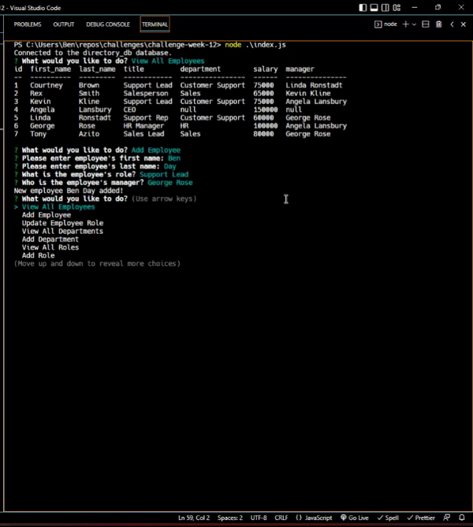

# Company Directory CLI

## Description

This app is a Command Line Interface for adding and tracking company information, such as employee records, departments, and salary information.

## Table of Contents

- [Company Directory CLI](#company-directory-cli)
  - [Description](#description)
  - [Table of Contents](#table-of-contents)
  - [Installation](#installation)
  - [Usage](#usage)
  - [Credits](#credits)
  - [License](#license)
  - [How to Contribute](#how-to-contribute)
  - [Tests](#tests)
  - [Questions](#questions)

## Installation

To install this app, clone this repo, then open the terminal and run the command npm i to install the dependencies.

## Usage

To use this app, open the terminal then run the command node index.js. Once the app has started you will receive a series of prompts. Select the option you prefer, then fill out the remaining prompts if necessary. Once you have reviewed or added the required information, select Exit to end the application.

## Credits

N/A

## License

This software is licensed under the MIT license.

---

## How to Contribute

N/A

## Tests

N/A

## Questions

Please forward any and all questions to benjaminmichaelday@gmail.com

GitHub username: benmday
